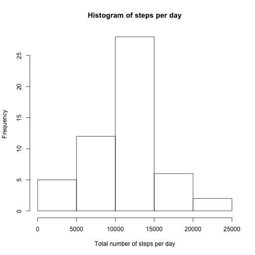
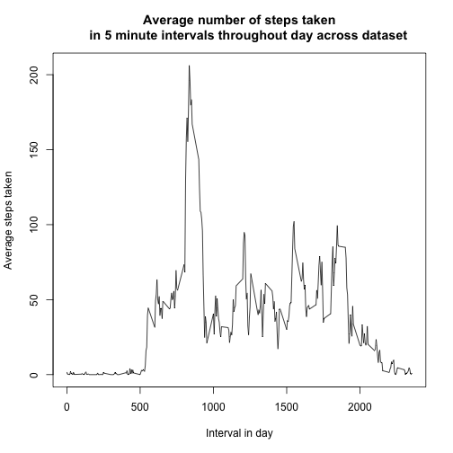
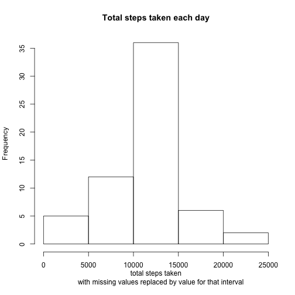
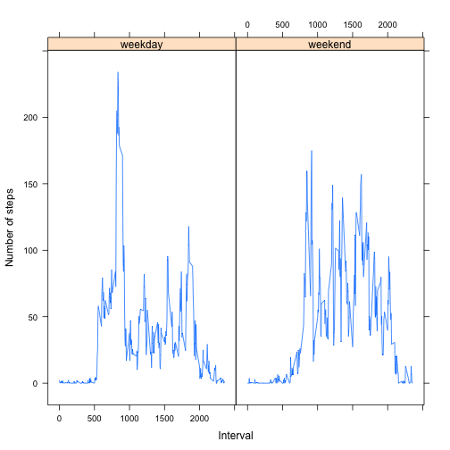

Here's how to load the data


```r
#set working directory

setwd("/Users/nat/Desktop/Coursera-Data Science/5_Reproducible Research/Peer1/")
getwd()
```

```
## [1] "/Users/nat/Desktop/Coursera-Data Science/5_Reproducible Research/Peer1"
```

```r
#download zip file

url<- "http://d396qusza40orc.cloudfront.net/repdata%2Fdata%2Factivity.zip"
tempFile<- tempfile()
download.file(url,destfile=tempFile)
```

```
## Warning in download.file(url, destfile = tempFile): unable to resolve
## 'd396qusza40orc.cloudfront.net'
```

```
## Error in download.file(url, destfile = tempFile): cannot open URL 'http://d396qusza40orc.cloudfront.net/repdata%2Fdata%2Factivity.zip'
```

```r
file<- unzip(tempFile)
```

```
## Warning in unzip(tempFile): error 1 in extracting from zip file
```

```r
data<- read.csv(file, colClasses=c("integer", "Date","integer"),na.strings="NA")
```

```
## Error in file(file, "rt"): invalid 'description' argument
```
What is mean total number of steps taken per day?

1 Calculate the total number of steps taken per day

```r
library(stats)
stepsPday <- aggregate(steps~date,data,sum)
names(stepsPday) <- c("date","total steps")
```

2 If you do not understand the difference between a histogram and a barplot, research the difference between them. Make a histogram of the total number of steps taken each day

```r
library(graphics)
hist(stepsPday[,2],xlab="Total number of steps per day",ylab="Frequency",
     main="Histogram of steps per day")
```

 

3 Calculate and report the mean and median of the total number of steps taken per day

```r
mean<- mean(stepsPday[,2],na.rm=TRUE)
median<- median(stepsPday[,2],na.rm=TRUE)
paste0 ("The mean number of steps per day is ",mean, " and the median number of steps per day is ",median," where NA values are ignored")
```

```
## [1] "The mean number of steps per day is 10766.1886792453 and the median number of steps per day is 10765 where NA values are ignored"
```

What is the average daily activity pattern?

1 Make a time series plot (i.e. type = "l") of the 5-minute interval (x-axis) and the average number of steps taken, averaged across all days (y-axis)

```r
library(stats)
daypattern<- aggregate(steps~interval,data,FUN="mean",rm.na=TRUE)
plot(daypattern$interval,daypattern$steps,type="l",xlab="Interval in day",
     ylab="Average steps taken",main="Average number of steps taken
     in 5 minute intervals throughout day across dataset")
```

 

2 Which 5-minute interval, on average across all the days in the dataset, contains the maximum number of steps?


```r
max<- data[which.max(daypattern$steps),]
max<- max[1,3]
paste0("The 5-minute interval with the greatest number of steps is: ",max)
```

```
## [1] "The 5-minute interval with the greatest number of steps is: 835"
```

Inputting missing values

1 Calculate and report the total number of missing values in the dataset (i.e. the total number of rows with NAs)


```r
NAs<- sum(is.na(data$steps))
NAs
```

```
## [1] 2304
```

```r
paste0("There are ",NAs," NA step values in the data")
```

```
## [1] "There are 2304 NA step values in the data"
```

2 Devise a strategy for filling in all of the missing values in the dataset. The strategy does not need to be sophisticated. For example, you could use the mean/median for that day, or the mean for that 5-minute interval, etc.

I have replaced the NA values with the average value for that interval in the day

3 Create a new dataset that is equal to the original dataset but with the missing data filled in.

I've created a fourth column in the data set which replaces NA values with the average value for that 5-mn interval.


```r
data[,4]<- paste0(data[,1])
names(data)<- c("steps","date","interval","newSteps")
#replace missing steps values in data with the corresponding interval value
for (i in 1:nrow(data))
{
       if(is.na(data[i,1]) )
        {    
             data[i,4]<-daypattern[daypattern[,1]== data[i,3] ,2]
       }
}
```

4 Make a histogram of the total number of steps taken each day and Calculate and report the mean and median total number of steps taken per day. Do these values differ from the estimates from the first part of the assignment? What is the impact of imputing missing data on the estimates of the total daily number of steps?

This is the histogram where I've replaced missing values.


```r
library(stats)
data$newSteps<-as.numeric(data$newSteps)
stepsPDnoNA<- aggregate(newSteps~date,data,sum)
hist(stepsPDnoNA[,2],main="Total steps taken each day",xlab="total steps taken
     with missing values replaced by value for that interval",
     ylab="Frequency")
```

 

Here are the mean and median values when the NA values in the original dataset are replaced by value for that interval.


```r
mean<- mean(stepsPDnoNA[,2])
median<- median(stepsPDnoNA[,2])
median
```

```
## [1] 10766.19
```

```r
paste0 ("The mean number of steps per day is ",mean, " and the median number of steps per day is ",median," where NA values are replaced by average values for that interval")
```

```
## [1] "The mean number of steps per day is 10766.1886792453 and the median number of steps per day is 10766.1886792453 where NA values are replaced by average values for that interval"
```

The impact of replacing missing values with the corresponding value for that interval in the day is that:
- mean stays the same at 10766.188
- median increases from 10765 to 10766.188.


Are there differences in activity patterns between weekdays and weekends?

1 Create a new factor variable in the dataset with two levels – “weekday” and “weekend” indicating whether a given date is a weekday or weekend day.


```r
no<- "weekday"
yes<-"weekend"
for (i in 1:nrow(data))
{
   data$weekday<- weekdays(data[,2]) 
   data$WE<- ifelse(data$weekday=="Saturday"|data$weekday=="Sunday",
                     yes,no)
}
table(data$WE)
```

```
## 
## weekday weekend 
##   12960    4608
```

```r
data$WE<-as.factor(data$WE)
```


2 Make a panel plot containing a time series plot (i.e. type = "l") of the 5-minute interval (x-axis) and the average number of steps taken, averaged across all weekday days or weekend days (y-axis). 


```r
library (lattice)
daypattern2<- aggregate(steps~interval+WE,data,FUN="mean")
xyplot(steps~interval|WE,daypattern2,type="l",ylab="Number of steps",xlab="Interval")
```

 
